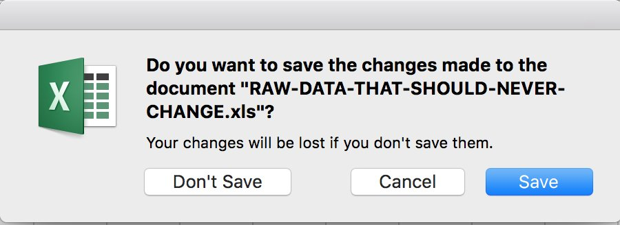

```{r startup, include = FALSE, message = FALSE, warning = FALSE}
# This is good for getting the ggplot background consistent with
# the html background color
library(ggplot2)
thm <- theme_bw() + 
  theme(
    panel.background = element_rect(fill = "transparent", colour = NA), 
    plot.background = element_rect(fill = "transparent", colour = NA),
    legend.position = "top",
    legend.background = element_rect(fill = "transparent", colour = NA),
    legend.key = element_rect(fill = "transparent", colour = NA)
  )
theme_set(thm)
```

# Outline

* Quick introductions around the room
* Quick points on R (and why you made the right choice)
* R Programming!


---
layout: false
class: inverse, middle, center

# Introductions

---

# Introductions

* Name

* Experience in Programming

* What problems are you interested in solving with R?

```{r echo=FALSE, fig.align='center'}
knitr::include_graphics("figures/do_here_resize.gif", dpi = 1000)
```

---

# Intro to R

.pull-left[
* R is an __open source__ statistical **environment** developed in 1993 based on the S language developed at Bell Labs

* Functional Programming Language

* More than 10k packages (extensions) available on CRAN

* Cutting edge research typically generates R packages

* Rstudio's IDE

]
.pull-right[
```{r echo=FALSE, fig.asp=.5}
knitr::include_graphics("figures/rlogo.png")
```

]

---

# Open Source Means No Funding???

.pull-left[
* R Core

* R Foundation

* RStudio

* Users Like You

]

.pull-right[
```{r echo = FALSE, fig.height=2}
knitr::include_graphics("figures/google.png", dpi = 400)
```

```{r echo= FALSE, fig.asp=.5}
knitr::include_graphics("figures/ms_logo.svg")
```

```{r echo= FALSE, fig.asp=.5}

```
]

---

# So why R?

.pull-left[

* Data Analysis Language

* Reproducibility

* Integration to direct communication

  * Rmarkdown Documents
  
  * Shiny Dashboards
  
* Tidyverse!
]

.pull-right[
```{r echo=FALSE, fig.align='center'}

```

```{r echo=FALSE, fig.align='center'}
knitr::include_graphics("figures/version_control.png", dpi = 3)
```

]
---

# Let's Get Started!
.pull-center[
```{r echo=FALSE, fig.asp=2, fig.align='center'}

```
]

