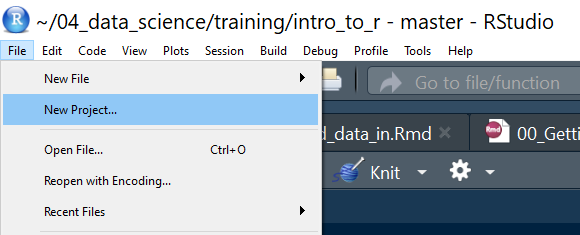
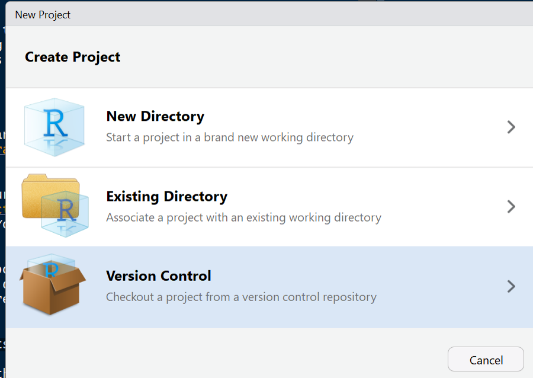
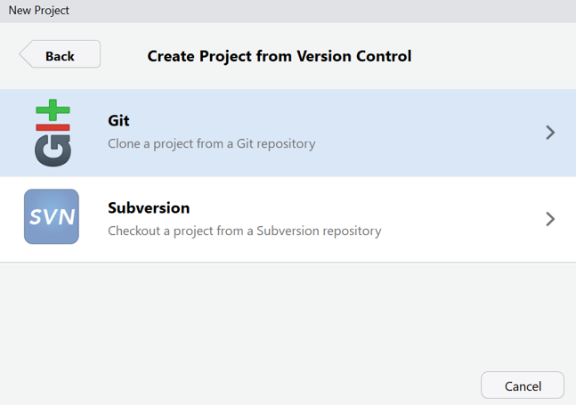
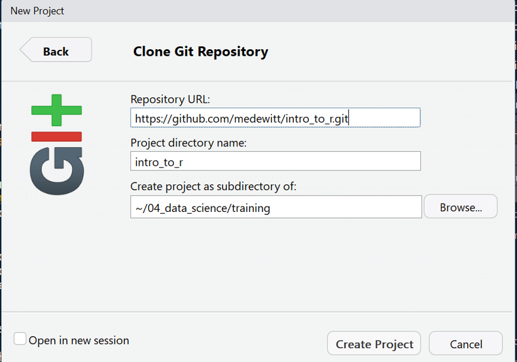

<!-- README.md is generated from README.Rmd. Please edit that file -->
Introduction to R
=================

The goal of this repository is to introduce some topics to novice R users. Sometimes the most intimidating part of anything with a command line interface is starting. So let's start with a constructive was of getting started.

Getting R
---------

-   First step is to go to CRAN and download the base version of R for your operating system at <https://cran.r-project.org/>

-   Next download RStudio for your operating system. This can be done at <https://www.rstudio.com/products/rstudio/download/>. You want the open source RStudio Desktop. It's free.

-   Next install Git. Git is a version control system that also doubles down as a great way to share information and files (especially code). Atlassian has put together a nice "how-to" here <https://www.atlassian.com/git/tutorials/install-git>

    -   If you have a windows system go [here](https://gitforwindows.org/)
    -   If you have a MAC system you should already have git. If not then go [here](https://sourceforge.net/projects/git-osx-installer/files/)

After you have installed them both (in that order) open up R Studio! This will be your IDE or integrated development environment. RStudio has done an amazing job with all the features and has really made R into an enterprise ready solution.

Getting the Example Documents
-----------------------------

The next step is pulling down these documents for use. This can be done by opening RStudio and then creating a new project

File --&gt; New Project

From there you will select the `Version Control` feature to check checkout my infomation from github.

I use `Git` as my version control system so go ahead and select that option.

Now enter the following URL into the `Repository URL` field.

<https://github.com/medewitt/intro_to_r.git>

Select where you would like to put this collection of documents and then hit `create project`.

Now we're off!
